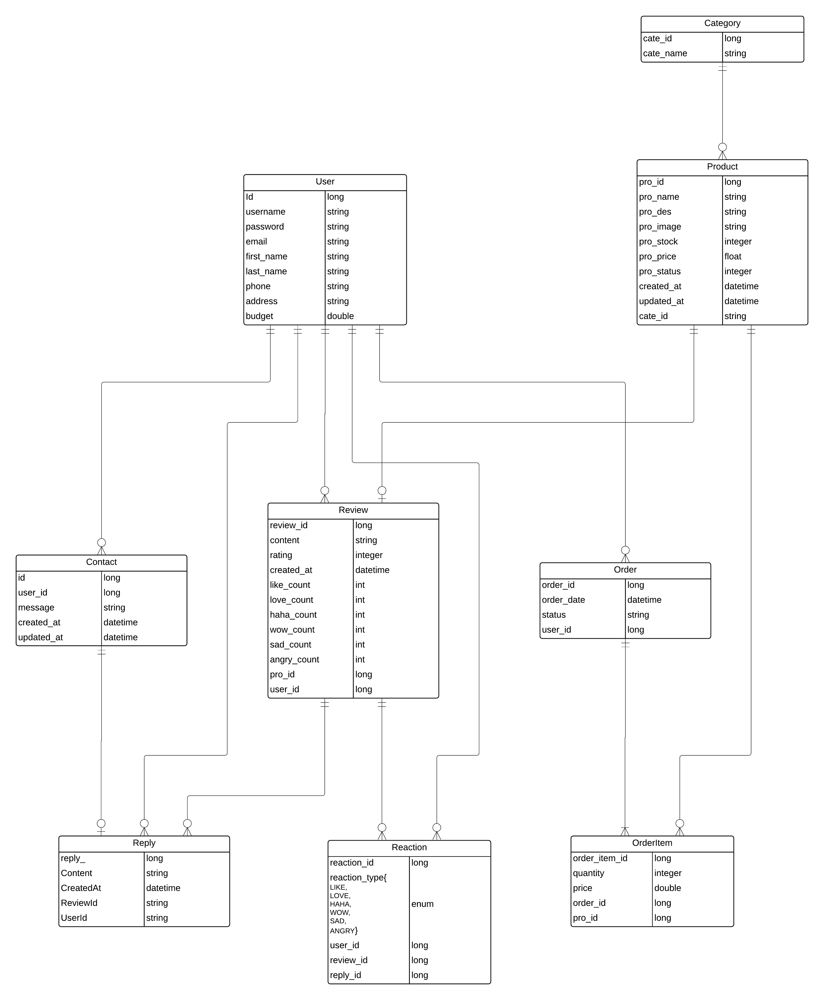
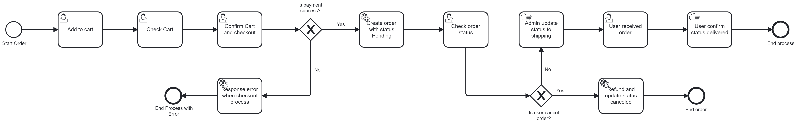

# Shopping Website Project

A modern e-commerce shopping website built with Angular, Spring Boot, TailwindCSS, Keycloak, JasperReports.

---

## Features

- **User Authentication & Authorization**: Secure SSO with Keycloak, with role-based access control managed via bearer tokens.
- **Responsive Design**: Tailored UI with TailwindCSS.
- **Product Management**: Full CRUD operations for products.
- **Cart & Checkout**: Seamless cart management and checkout flow.
- **Order Management**: Track and process user orders efficiently.
- **Dynamic Reporting**: Generate PDF reports using JasperReports.
- **Excel Integration**: Import/export product and order data using Apache POI.

---

## Tech Stack

### Frontend
- **Framework**: Angular (latest version)
- **Styling**: TailwindCSS (latest version)
- **State Management**: Angular Services
- **Key Features**:
  - Dynamic product listings
  - Reactive forms for registration and checkout
  - Integration with Keycloak for bearer token-based authentication

### Backend
- **Framework**: Spring Boot (latest version)
- **Database**: PostgreSQL (latest version)
- **Authentication**: Keycloak for SSO with OAuth2 and OpenID Connect
- **Authorization**: Role-based access control using bearer tokens
- **Reporting**: JasperReports (6.20.6)
- **Excel Handling**: Apache POI (5.3)
- **Key Features**:
  - RESTful APIs for seamless frontend-backend communication
  - Role-based authorization for `user` and `admin` roles
  - Shopping cart management using HTTP sessions
  - Cart, order, and user profile management

---

## Database Design

Below is the Entity-Relationship Diagram (ERD) for the project:



### **Key Tables**
- **User**: Manages user credentials and profile details.
- **Product**: Stores product information.
- **Category**: Categorizes products.
- **Order**: Tracks user orders and their statuses.
- **OrderItem**: Links products to orders.
- **Review**: Allows users to add product reviews.
- **Reaction**: Captures user reactions to reviews or replies.
- **Contact**: Stores user inquiries and messages.
- **Reply**: Captures admin or user replies to inquiries.

### **Entities and Relationships**

#### 1. **User**
- **Purpose**: Stores user information, including authentication details and profile data.
- **Key Fields**:
  - `id`: Unique identifier for each user.
  - `username`: User's login name (unique).
  - `password`: Encrypted password.
  - `email`: User's email address.
  - `first_name` & `last_name`: User's name details.
  - `phone` & `address`: Contact details for delivery and communication.
  - `budget`: User's available budget for purchases.
- **Relationships**:
  - Linked to `Order` (one-to-many) for tracking orders.
  - Linked to `Review`, `Reaction`, `Contact`, and `Reply`.

#### 2. **Category**
- **Purpose**: Categorizes products for easier navigation and filtering.
- **Key Fields**:
  - `cate_id`: Unique identifier for each category.
  - `cate_name`: Name of the category.
- **Relationships**:
  - Linked to `Product` (one-to-many).

#### 3. **Product**
- **Purpose**: Represents items available for purchase on the platform.
- **Key Fields**:
  - `pro_id`: Unique identifier for each product.
  - `pro_name`: Name of the product.
  - `pro_des`: Description of the product.
  - `pro_image`: Path to the product image.
  - `pro_stock`: Quantity of the product in stock.
  - `pro_price`: Price of the product.
  - `pro_status`: Indicates product availability (e.g., active/inactive).
  - `created_at` & `updated_at`: Timestamps for product creation and updates.
  - `cate_id`: Foreign key linking the product to a category.
- **Relationships**:
  - Linked to `OrderItem` (one-to-many) for order tracking.
  - Linked to `Review` (one-to-many) for user reviews.

#### 4. **Order**
- **Purpose**: Tracks purchase transactions made by users.
- **Key Fields**:
  - `order_id`: Unique identifier for each order.
  - `order_date`: Date and time of the order.
  - `status`: Status of the order (e.g., PENDING, SHIPPING, DELIVERED).
  - `user_id`: Foreign key linking the order to a user.
- **Relationships**:
  - Linked to `OrderItem` (one-to-many) for individual products in the order.

#### 5. **OrderItem**
- **Purpose**: Represents products associated with a specific order.
- **Key Fields**:
  - `order_item_id`: Unique identifier for each order item.
  - `quantity`: Quantity of the product ordered.
  - `price`: Price of the product at the time of order.
  - `order_id`: Foreign key linking the item to an order.
  - `pro_id`: Foreign key linking the item to a product.

#### 6. **Review**
- **Purpose**: Allows users to leave reviews and ratings for products.
- **Key Fields**:
  - `review_id`: Unique identifier for each review.
  - `content`: Review text content.
  - `rating`: Star rating for the product.
  - `like_count`, `love_count`, etc.: Reaction counts for each type of reaction (e.g., LIKE, LOVE).
  - `created_at`: Timestamp for when the review was created.
  - `pro_id`: Foreign key linking the review to a product.
  - `user_id`: Foreign key linking the review to a user.
- **Relationships**:
  - Linked to `Reaction` (one-to-many) for user reactions.

#### 7. **Reaction**
- **Purpose**: Tracks user reactions (e.g., LIKE, LOVE) on reviews and replies.
- **Key Fields**:
  - `reaction_id`: Unique identifier for each reaction.
  - `reaction_type`: Type of reaction (enum: LIKE, LOVE, HAHA, WOW, SAD, ANGRY).
  - `user_id`: Foreign key linking the reaction to a user.
  - `review_id`: Foreign key linking the reaction to a review.
  - `reply_id`: Foreign key linking the reaction to a reply.

#### 8. **Contact**
- **Purpose**: Stores user inquiries or messages sent through the platform.
- **Key Fields**:
  - `id`: Unique identifier for each contact message.
  - `user_id`: Foreign key linking the message to a user.
  - `message`: Content of the user’s message.
  - `created_at` & `updated_at`: Timestamps for the message.

#### 9. **Reply**
- **Purpose**: Tracks replies to user inquiries.
- **Key Fields**:
  - `reply_id`: Unique identifier for each reply.
  - `content`: Text content of the reply.
  - `created_at`: Timestamp for when the reply was created.
  - `review_id`: Foreign key linking the reply to a review (if applicable).
  - `user_id`: Foreign key linking the reply to a user.
---

## Shopping Cart Functionality

### **Cart Management Using HTTP Sessions**
- The shopping cart is managed using **HTTP sessions** in the backend.
- When a user adds a product to the cart, it is stored in the session under a unique identifier.
- The cart contents are not persisted in the database until the user confirms the checkout.
- Session data structure:
  ```json
  {
    "cartItems": [
      {
        "productId": 101,
        "quantity": 2,
        "price": 500.0
      },
      {
        "productId": 102,
        "quantity": 1,
        "price": 300.0
      }
    ],
    "totalPrice": 1300.0
  }
    ```
## **Login Process Flow**

1. **Custom Login Form**:
   - Users enter their credentials (username and password) into a custom login form on the frontend (Angular).
   - The login request is sent to the backend (Spring Boot API).

2. **Backend Authentication**:
   - The backend communicates with Keycloak's token endpoint to authenticate the user.
   - The backend sends the user-provided credentials to Keycloak and validates the response.

3. **Keycloak Integration**:
   - Keycloak acts as the SSO provider and verifies the user's credentials.
   - The `custom-provider-user-database` is configured to allow Keycloak to fetch user details from the PostgreSQL database.
   - If the user exists in the PostgreSQL database and the credentials are valid, Keycloak generates a bearer token with role claims.

4. **Bearer Token and Roles**:
   - The bearer token includes user information and assigned roles (e.g., `user`, `admin`) defined in Keycloak.
   - The token is sent back to the frontend as part of the login response.

5. **Frontend Authorization**:
   - The frontend stores the bearer token (e.g., in `localStorage` or `sessionStorage`).
   - The token is included in subsequent API requests for authorization.
   - Roles within the token control access to specific resources and actions on the website.

---

## **Keycloak Custom User Storage Provider**

Keycloak integrates with a custom PostgreSQL database through the `custom-provider-user-database`. The provider ensures that Keycloak can:
- Authenticate users directly against the PostgreSQL database.
- Retrieve basic user details, such as `username` and `email`, from the database.
- Roles are **not stored in PostgreSQL** but are managed directly within Keycloak.

### **Steps to Implement the Custom User Storage Provider**:
1. **Create the Provider**:
   - Develop a custom provider in Java by implementing Keycloak's `UserStorageProvider` interface.
   - Use JDBC to connect to the PostgreSQL database.

2. **Database Querying**:
   - Implement methods for querying the PostgreSQL database to:
     - Validate user credentials.
     - Fetch user details such as `username` and `email`.

3. **Deploy the Provider**:
   - Package the provider as a JAR file and deploy it to the `providers/` directory of the Keycloak server.
   - Configure the custom provider in Keycloak’s admin console.

---

## **Bearer Token and Role Management**

- **Bearer Token**:
  - After successful login, Keycloak generates a bearer token containing:
    - User details (e.g., `username`, `email`).
    - Role assignments (e.g., `user`, `admin`) defined and managed within Keycloak.
  - The token is signed and includes claims for secure authorization.

- **Role-Based Access**:
  - Roles are directly managed in Keycloak and included as claims in the bearer token.
  - The backend extracts the roles from the token for authorization.
  - Example token payload:
    ```json
    {
      "sub": "12345",
      "username": "john_doe",
      "email": "john@example.com",
      "realm_access": {
        "roles": ["user", "admin"]
      }
    }
    ```

---

## **Login API Flow**

1. **Frontend**:
   - Sends a login request to the backend API endpoint, e.g., `/api/auth/login`.
   - Example Request:
     ```json
     {
       "username": "john_doe",
       "password": "secure_password"
     }
     ```

2. **Backend**:
   - Forwards the credentials to Keycloak's token endpoint:
     ```
     POST http://localhost:8080/realms/{realm-name}/protocol/openid-connect/token
     ```
   - Example Request:
     ```x-www-form-urlencoded
     grant_type: password
     client_id: frontend-client
     username: john_doe
     password: secure_password
     ```

3. **Keycloak**:
   - Validates the credentials via the `custom-provider-user-database`.
   - If valid, generates a bearer token with role claims.

4. **Backend Response**:
   - Sends the bearer token back to the frontend.
   - Example Response:
     ```json
     {
       "access_token": "eyJhbGciOiJIUzI1...",
       "expires_in": 3600,
       "token_type": "Bearer",
       "scope": "openid email profile"
     }
     ```

5. **Frontend**:
   - Stores the token for subsequent API requests.
   - Includes the token in the `Authorization` header of each request:
     ```
     Authorization: Bearer eyJhbGciOiJIUzI1...
     ```
---

## **Advantages of Using Keycloak with a Custom Provider**
1. **Centralized Authentication**:
   - Keycloak handles SSO and centralizes authentication for all applications.

2. **Custom Database Support**:
   - The `custom-provider-user-database` allows seamless integration with an existing PostgreSQL database.

3. **Secure Token-Based Authorization**:
   - Bearer tokens ensure secure communication between the frontend and backend.

4. **Role Management in Keycloak**:
   - Roles are managed directly in Keycloak, making the system more flexible and decoupled from the database.

5. **Scalability**:
   - The setup can handle complex user and role structures across multiple services.

---

## JasperReports Integration

### Purpose:
- **JasperReports** is used in this project to generate dynamic and customizable reports. Reports are created using data fetched from the PostgreSQL database, providing insights into the system's performance and resources.

### Features:
- Generates reports in multiple formats (PDF, Excel, HTML, etc.).
- Uses PostgreSQL queries to dynamically populate data.
- Supports complex reporting with visual elements like tables, charts, and images.

### File: `product_report.jrxml`
- This file defines the structure and layout of the product report.
- **Purpose**: Provides a detailed overview of the products, including:
  - Product ID
  - Product Name
  - Category
  - Price
  - Stock
  - Status
- **Workflow**:
  1. The backend uses JasperReports to compile the `product_report.jrxml` file.
  2. Data is fetched directly from the PostgreSQL database using the defined SQL queries in the report.
  3. The generated report is exported to the desired format (e.g., PDF or Excel).
- **API Endpoint**:
  - Example: `/api/reports/products`
  - Parameters (optional): Date range, category filter, or other report-specific options.
  - Response: A downloadable report file (e.g., `product_report.pdf`).

### How to Use:
1. Open the `product_report.jrxml` file in a JasperReports-compatible editor (e.g., JasperSoft Studio) for modifications.
2. Configure your database connection within the report.
3. Access the report generation API from the frontend or postman to download the generated reports.

---

## Camunda BPM Integration

### Purpose:
- **Camunda BPM** is integrated into the system to manage and automate business processes like the **checkout process**.
- The BPMN file, `checkout_process.bpmn`, defines the complete workflow for processing an order from the cart to completion.

### File: `checkout_process.bpmn`
- This BPMN file describes the automated process for managing checkout operations, ensuring a smooth and efficient workflow.

### Workflow Overview:
1. **Start Event**: Initiates the checkout process when a user confirms their cart.
2. **Tasks**:
   - **Validate Cart**: Validates the products in the user's cart (e.g., checking stock availability).
   - **Process Payment**: Interacts with payment services to deduct the amount.
   - **Update Inventory**: Updates product stock in the database after successful payment.
   - **Notify User**: Sends an email notification to the user about the order status.
3. **End Event**: Completes the process after all tasks are executed successfully.

### Camunda Process Diagram:


### Camunda Components Used:
- **Service Tasks**: Automate backend interactions (e.g., stock update, payment processing).
- **User Tasks**: Requires manual intervention (e.g., review for high-value orders).
- **Decision Tables**: Implements business rules (e.g., discount policies, payment validation).

### Deployment:
1. Upload the `checkout_process.bpmn` file to the Camunda engine via the web interface or REST API.
2. Configure the Camunda engine to interact with the backend services for task execution.

### API Endpoint:
- **Endpoint**: `/api/checkout`
- **Request Body**:
  ```json
  {
    "userId": 123,
    "cartItems": [
      {
        "productId": 101,
        "quantity": 2
      },
      {
        "productId": 102,
        "quantity": 1
      }
    ]
  }
